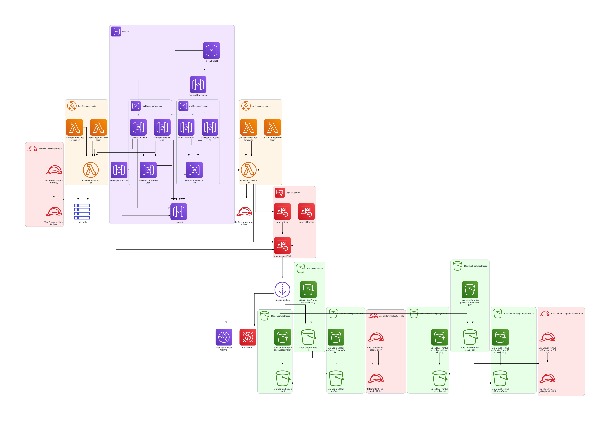

# AWS CloudFormation Diagrams

[](https://github.com/philippemerle/AWS-CloudFormation-Diagrams/blob/main/LICENSE)


A simple CLI script to generate AWS architecture diagrams from AWS CloudFormation templates.

## Features

* Parses both YAML and JSON AWS CloudFormation templates
* Supports [140 AWS resource types and any custom resource types](docs/supported_resource_types.md)
* Generates DOT, GIF, JPEG, PDF, PNG, SVG, and TIFF diagrams
* Provides [126 generated diagram examples](diagrams/)

Have ideas? [Open an issue](https://github.com/philippemerle/AWS-CloudFormation-Diagrams/issues/new) or [start a discussion](https://github.com/philippemerle/AWS-CloudFormation-Diagrams/discussions/new).

## Prerequisites

Following software must be installed:

- [Python](https://www.python.org) 3.9 or higher
- `dot` command ([Graphviz](https://www.graphviz.org/))

## Installation

Following command installs required Python dependencies, i.e., [PyYAML](https://pyyaml.org) and [Diagrams](https://diagrams.mingrammer.com/).

```ssh
# using pip (pip3)
pip install PyYAML diagrams
```

## Usage

```bash
usage: aws-cfn-diagrams [-h] [-o OUTPUT] [-f FORMAT] [--embed-all-icons] filename

Generate AWS architecture diagrams from AWS CloudFormation templates

positional arguments:
  filename             the AWS CloudFormation template to process

options:
  -h, --help           show this help message and exit
  -o, --output OUTPUT  output diagram filename
  -f, --format FORMAT  output format, allowed formats are dot, dot_json, gif, jp2, jpe, jpeg, jpg, pdf, png, svg, tif, tiff, set to png by default
  --embed-all-icons    embed all icons into svg or dot_json output diagrams
```

## Examples

The folder [diagrams](diagrams) contains generated diagrams for most of [AWS CloudFormation templates](
https://github.com/aws-cloudformation/aws-cloudformation-templates).



## License

This project is licensed under the [Apache 2.0 License](https://github.com/philippemerle/AWS-CloudFormation-Diagrams/blob/main/LICENSE).

## Contributing

[PRs](https://github.com/philippemerle/AWS-CloudFormation-Diagrams/pulls) and [ideas](https://github.com/philippemerle/AWS-CloudFormation-Diagrams/discussions/categories/ideas) are welcome!

## Star History

[](https://www.star-history.com/#philippemerle/AWS-CloudFormation-Diagrams&type=date&legend=top-left)
