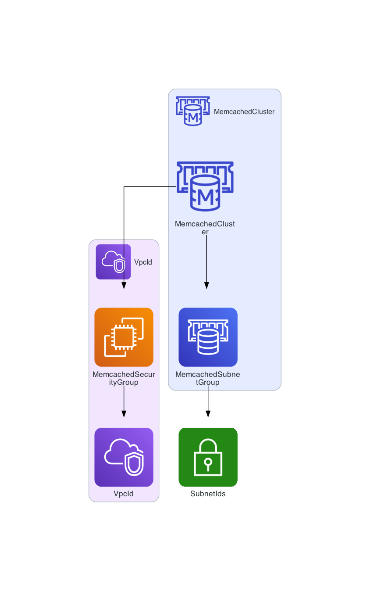
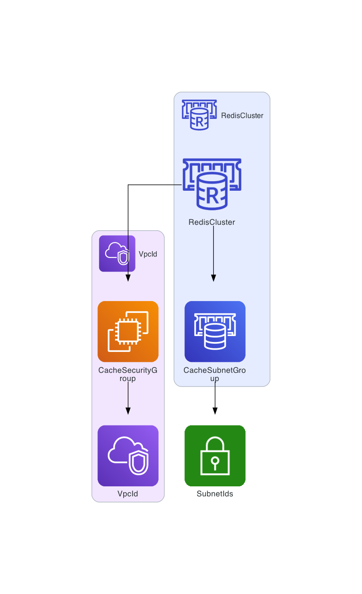
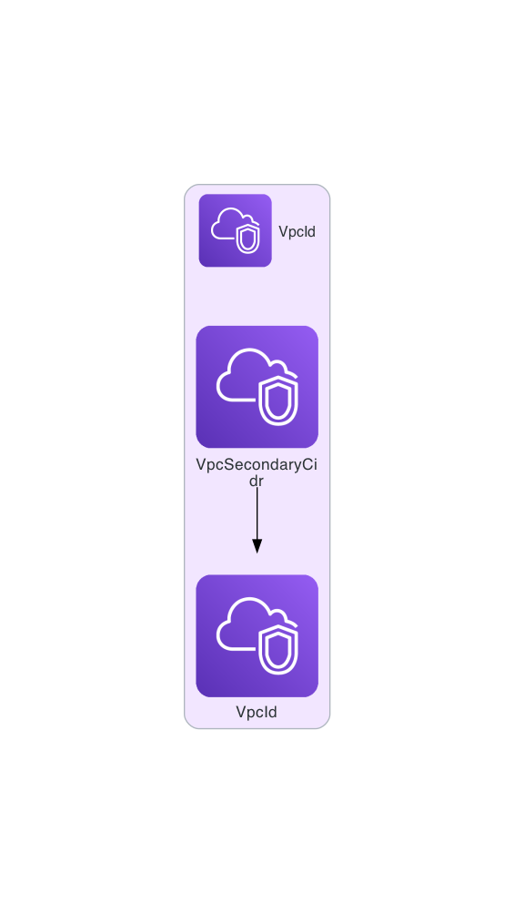
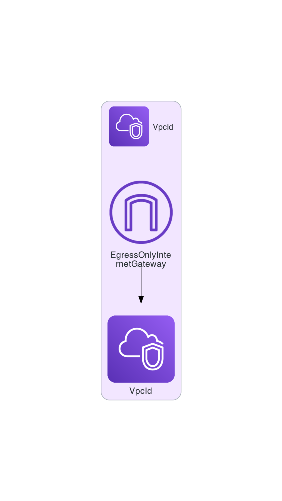
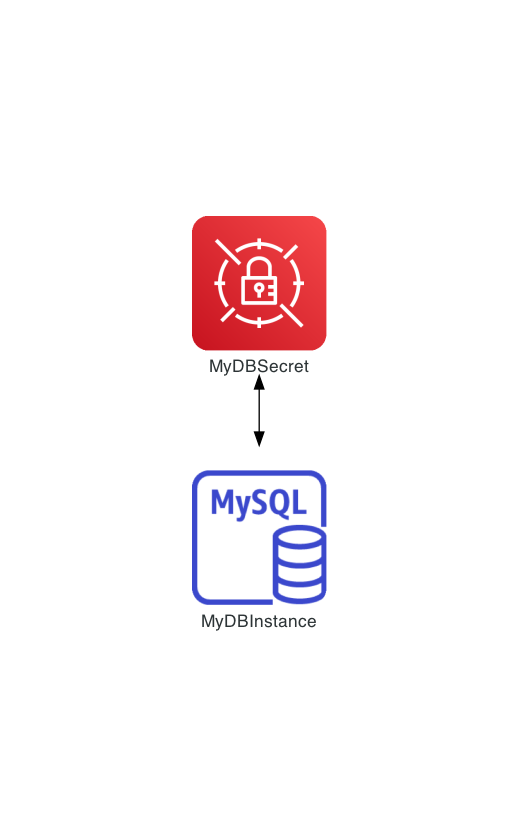
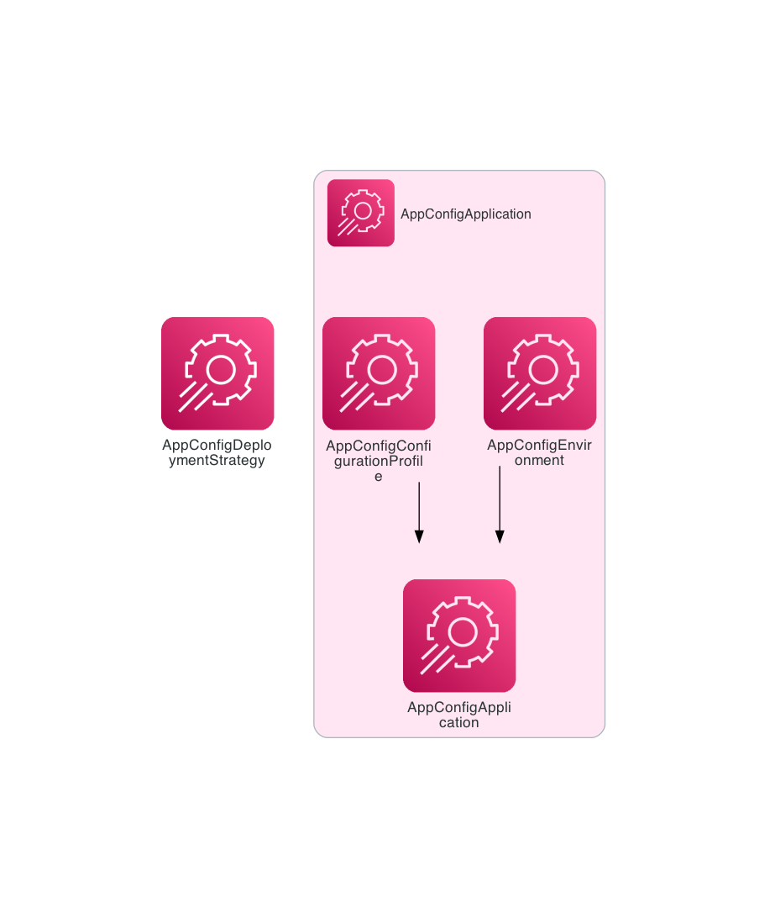
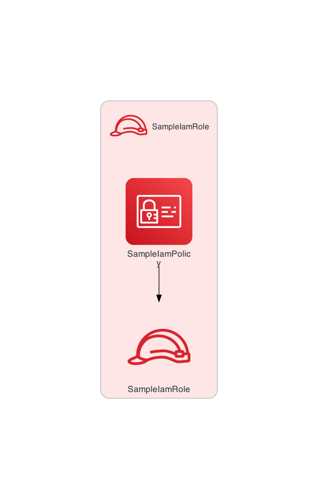
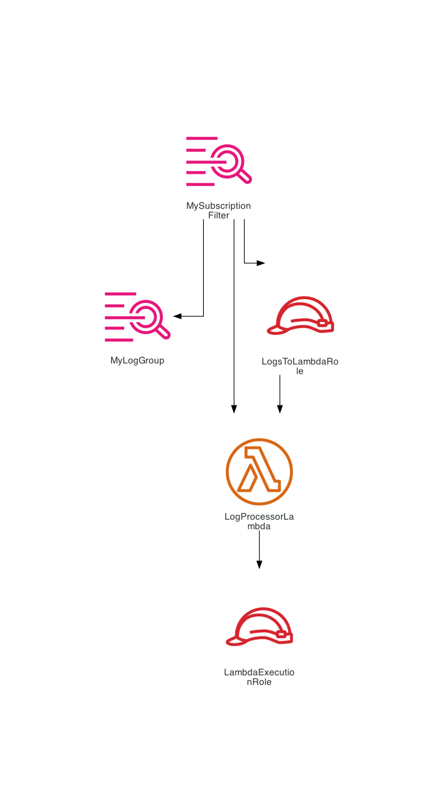
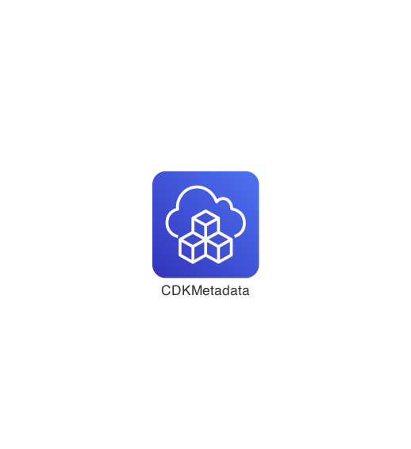
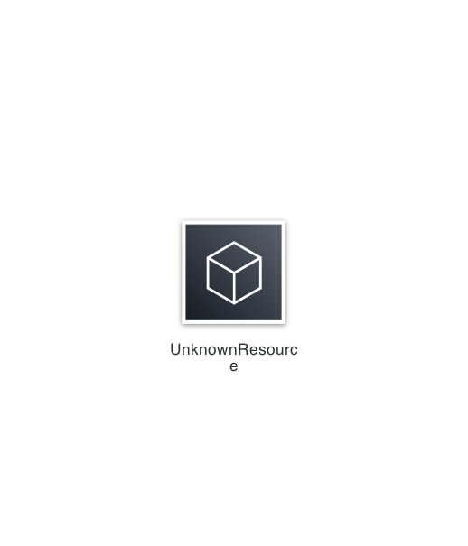

# WordPress Example

This contains several simple templates generated with ChatGPT.

Infrastructure diagram generated from [ElastiCache-Memcached.yaml](ElastiCache-Memcached.yaml):

Infrastructure diagram generated from [ElastiCache-Redis.yaml](ElastiCache-Redis.yaml):

Infrastructure diagram generated from [VPCCidrBlock.yaml](VPCCidrBlock.yaml):

Infrastructure diagram generated from [EgressOnlyInternetGateway.yaml](EgressOnlyInternetGateway.yaml):

Infrastructure diagram generated from [SecretTargetAttachment.yaml](SecretTargetAttachment.yaml):

Infrastructure diagram generated from [AppConfig.yaml](AppConfig.yaml):

Infrastructure diagram generated from [IAM_Policy.yaml](IAM_Policy.yaml):

Infrastructure diagram generated from [Logs_SubscriptionFilter.yaml](Logs_SubscriptionFilter.yaml):

Infrastructure diagram generated from [CDK_Metadata.yaml](CDK_Metadata.yaml):

Infrastructure diagram generated from [Unknown_Resource_Type.yaml](Unknown_Resource_Type.yaml):

