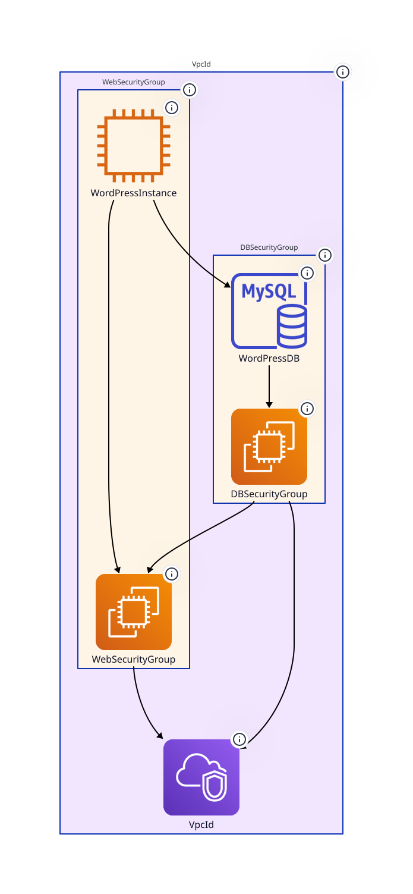

# WordPress Example

This is a simple WordPress deployment with RDS generated with ChatGPT.

## Generate a PNG diagram

Type

```sh
aws-cfn-diagrams WordPress-RDS.yaml
```

to generate the following `png` diagram.


## Generate a PDF diagram

Type

```sh
aws-cfn-diagrams -f pdf WordPress-RDS.yaml
```

to generate the following `pdf` diagram.


## Generate an SVG diagram

Type

```sh
aws-cfn-diagrams -f svg --embed-all-icons WordPress-RDS.yaml
```

to generate the following `svg` diagram.


## Generate a D2 diagram

Type

```sh
aws-cfn-diagrams -f d2 WordPress-RDS.yaml
```

to generate the [`WordPress-RDS.d2`](WordPress-RDS.d2) diagram.

Type

```sh
d2 WordPress-RDS.d2 WordPress-RDS.d2.svg
```

to generate the following `svg` diagram.



## Generate a Mermaid diagram

Type

```sh
aws-cfn-diagrams -f mermaid WordPress-RDS.yaml
```

to generate the [WordPress-RDS.mermaid](WordPress-RDS.mermaid) diagram rendered as follows:

```mermaid
flowchart TB
  subgraph cluster_VpcId [VpcId]
    direction TB
    style cluster_VpcId fill:#f2e6ff,color:#2D3436,font:sans-serif,font-size:12pt,stroke:box
    subgraph cluster_WebSecurityGroup [WebSecurityGroup]
      direction TB
      style cluster_WebSecurityGroup fill:#fff5e6,color:#2D3436,font:sans-serif,font-size:12pt,stroke:box
      resource_WebSecurityGroup@{ img: "https://raw.githubusercontent.com/mingrammer/diagrams/refs/heads/master/resources/aws/compute/ec2.png", label: "WebSecurityGroup", h: 120, constraint: "on" }
      style resource_WebSecurityGroup fill:none,stroke:none
      resource_WordPressInstance@{ img: "https://raw.githubusercontent.com/mingrammer/diagrams/refs/heads/master/resources/aws/compute/ec2-instance.png", label: "WordPressInstance", h: 120, constraint: "on" }
      style resource_WordPressInstance fill:none,stroke:none
    end
    subgraph cluster_DBSecurityGroup [DBSecurityGroup]
      direction TB
      style cluster_DBSecurityGroup fill:#fff5e6,color:#2D3436,font:sans-serif,font-size:12pt,stroke:box
      resource_DBSecurityGroup@{ img: "https://raw.githubusercontent.com/mingrammer/diagrams/refs/heads/master/resources/aws/compute/ec2.png", label: "DBSecurityGroup", h: 120, constraint: "on" }
      style resource_DBSecurityGroup fill:none,stroke:none
      resource_WordPressDB@{ img: "https://raw.githubusercontent.com/mingrammer/diagrams/refs/heads/master/resources/aws/database/rds-mysql-instance.png", label: "WordPressDB", h: 120, constraint: "on" }
      style resource_WordPressDB fill:none,stroke:none
    end
    resource_VpcId@{ img: "https://raw.githubusercontent.com/mingrammer/diagrams/refs/heads/master/resources/aws/network/vpc.png", label: "VpcId", h: 120, constraint: "on" }
    style resource_VpcId fill:none,stroke:none
  end
  resource_WebSecurityGroup --> resource_VpcId
  linkStyle 0 stroke:black,color:#2D3436,font:sans-serif,font-size:13pt
  resource_WordPressInstance --> resource_WebSecurityGroup
  linkStyle 1 stroke:black,color:#2D3436,font:sans-serif,font-size:13pt
  resource_WordPressInstance --> resource_WordPressDB
  linkStyle 2 stroke:black,color:#2D3436,font:sans-serif,font-size:13pt
  resource_DBSecurityGroup --> resource_WebSecurityGroup
  linkStyle 3 stroke:black,color:#2D3436,font:sans-serif,font-size:13pt
  resource_DBSecurityGroup --> resource_VpcId
  linkStyle 4 stroke:black,color:#2D3436,font:sans-serif,font-size:13pt
  resource_WordPressDB --> resource_DBSecurityGroup
  linkStyle 5 stroke:black,color:#2D3436,font:sans-serif,font-size:13pt
```

## Generate an interactive diagram

Type

```sh
aws-cfn-diagrams -f dot_json WordPress-RDS.yaml
```

to generate the [WordPress-RDS.dot_json](WordPress-RDS.dot_json) diagram.

Open the interactive viewer as follows.

```sh
open ../../interactive_viewer/index.html
```

Load [WordPress-RDS.dot_json](WordPress-RDS.dot_json) as illustrated as follows.


## Generate a draw.io diagram

Type

```sh
aws-cfn-diagrams -f drawio WordPress-RDS.yaml
```

to generate the [WordPress-RDS.drawio](WordPress-RDS.drawio) diagram. Then open it in [draw.io](https://www.drawio.com/) as follows.


