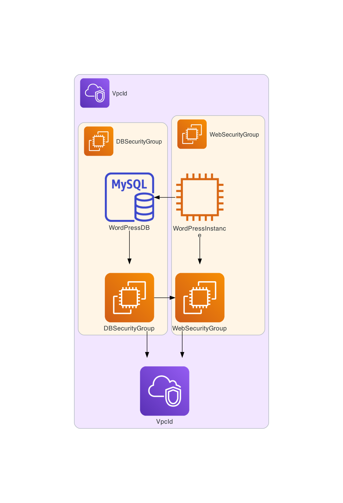
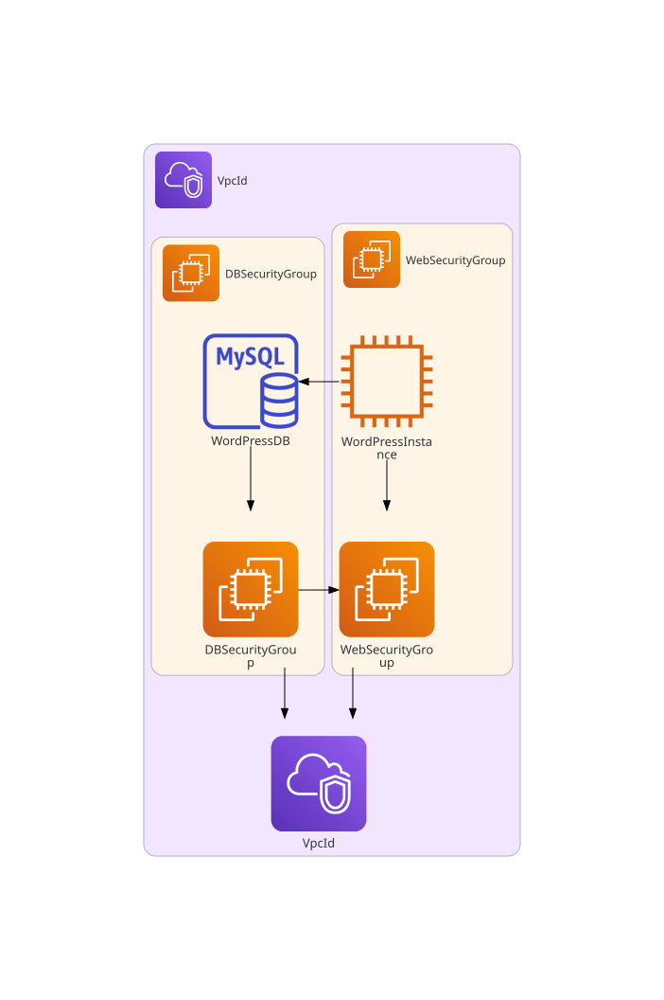
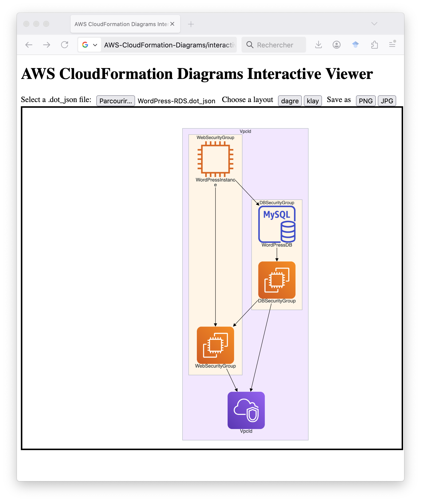
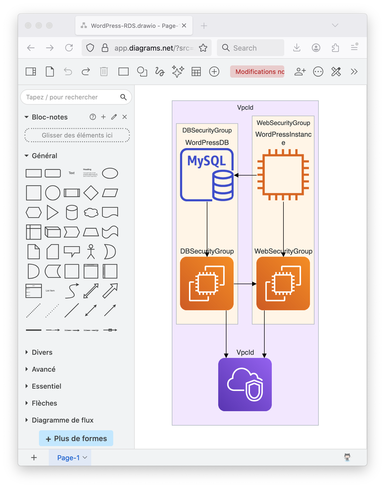

# WordPress Example

This is a simple WordPress deployment with RDS generated with ChatGPT.

Type

```sh
aws-cfn-diagrams WordPress-RDS.yaml
```

to generate the following `png` diagram.



Type

```sh
aws-cfn-diagrams -f pdf WordPress-RDS.yaml
```

to generate the following `pdf` diagram.


Type

```sh
aws-cfn-diagrams -f svg --embed-all-icons WordPress-RDS.yaml
```

to generate the following `svg` diagram.



Type

```sh
aws-cfn-diagrams -f dot_json WordPress-RDS.yaml
```

to generate the [WordPress-RDS.dot_json](WordPress-RDS.dot_json) diagram.

Open the interactive viewer as follows.

```sh
open ../../interactive_viewer/index.html
```

Load [WordPress-RDS.dot_json](WordPress-RDS.dot_json) as illustrated as follows.



Type

```sh
aws-cfn-diagrams -f drawio WordPress-RDS.yaml
```

to generate the [WordPress-RDS.drawio](WordPress-RDS.drawio) diagram. Then open it in [draw.io](https://www.drawio.com/) as follows.



